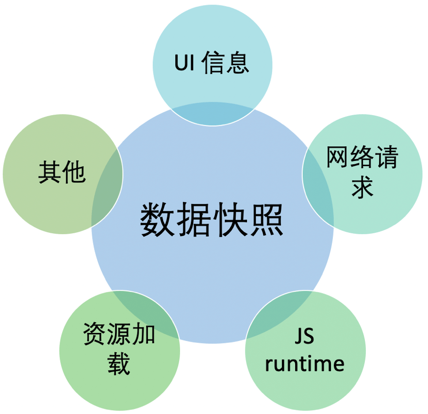
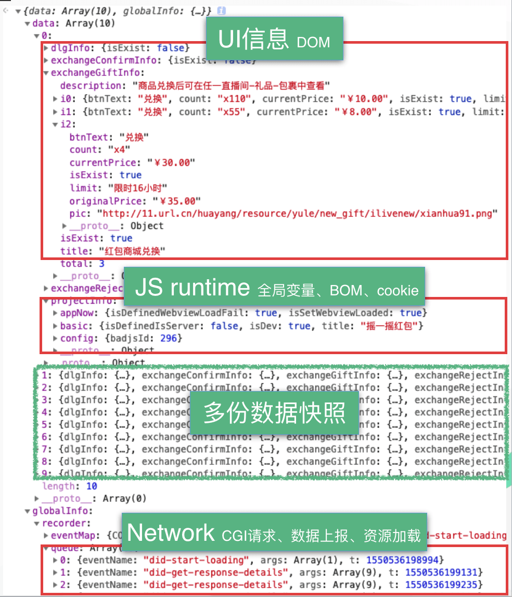

# 数据快照

数据快照为了更好的让程序理解，我们从页面快照中获取的数据。

## 1. 数据快照包含什么？

本质上，"页面快照"内包含的信息都可以在某种方式上转成"数据快照"，但对于端对端测试而已，追求的是最关键的信息，因此我们真正需要的"数据快照"只是"页面快照"的一个子集而已。



## 2. 数据快照更具体的例子

上面的示意图可能还是有点抽象，我们来看个更具体一些的例子。



## 3. 如何测试数据快照

拿到了数据快照之后，我们怎么测试呢？例如，上面的数据快照中，我们有个字段 `count` 代表的是礼包数量：

```json
{
  "count": "110"
}
```

我们可以使用单元测试的方式来验证结果是不是这个值。但是，实际场景中，这很难行得通。这个 `count` 的值是从接口返回的，而不同礼包的值不一样，怎么就确定为 `110` 而不是 `55` 呢？

不确定的输入，导致我们最后获取的数据快照是不确定，最终我们的测试就无从下手。

如何解决这个问题了，请查看 [基于白盒数据测试数据快照](test-by-mock.md) 一章。