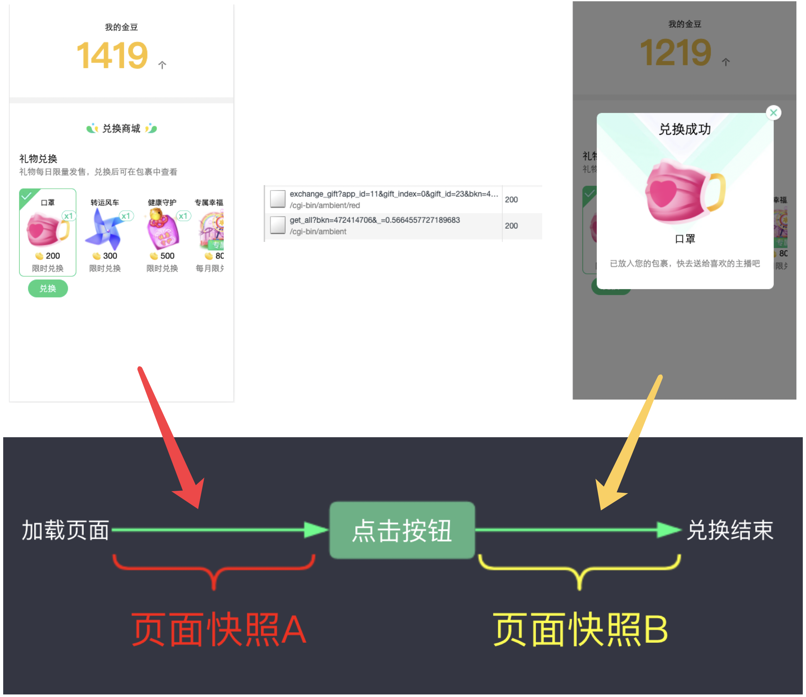

# 页面快照

页面快照是某个时间段内完整的页面状态，包含了多维度信息。

## 1. 页面快照包含什么？

“页面快照”的提出参考了搜索引擎中“网页快照”的概念，但它并不只是一个网页快照，而是某一个时间段内完整的页面状态，而是包含了：

- UI 信息及 DOM 变化
- 网络请求（CGI、数据上报）
- 资源加载
- jsbridge 调用
- JS runtime
- 浏览器其他事件
- ...

## 2. 每次的交互行为会产生新的"页面快照"

一个交互行为必然会产生一定的变化，变化之前和变化之后是两个不同的页面快照。

## 3. 举例说明

假如我们有个功能是"红包商城兑换"，支持"兑换礼物"，如下图所示。

用户点击了"兑换"之后，会产生两份页面快照：页面快照 A 和页面快照 B ,

页面快照中最明显的是 UI 信息：每个可兑换的礼物的价格、数量、名字、图片、限时条件等都不一样，而这些都是可以从页面快照中获得的。

那么，为什么会有这些信息呢？是因为我们请求了一次接口请求，根据返回的数据来进行展示，因此页面快照还至少包含了一次"网络请求"。

点击"兑换"按钮之后，显然会调用一次兑换接口，可能还会产生一次数据上报；兑换完成之后，页面UI可能还会发生变化，例如余额变化等。

包括上面列举的，这些所有的状态，构造了"页面快照"的组成。

## 4. 如何测试页面快照

页面快照对于程序而言是不友好的。比如一个按钮从可点击变为不可点击，我们可以一眼看出来，但程序无法感知。程序适合处理数据，因此我们还需要将其转换为程序可识别的数据，这就是“数据快照”。

更多细节请查看 [数据快照](data-snapshot.md) 一章。

