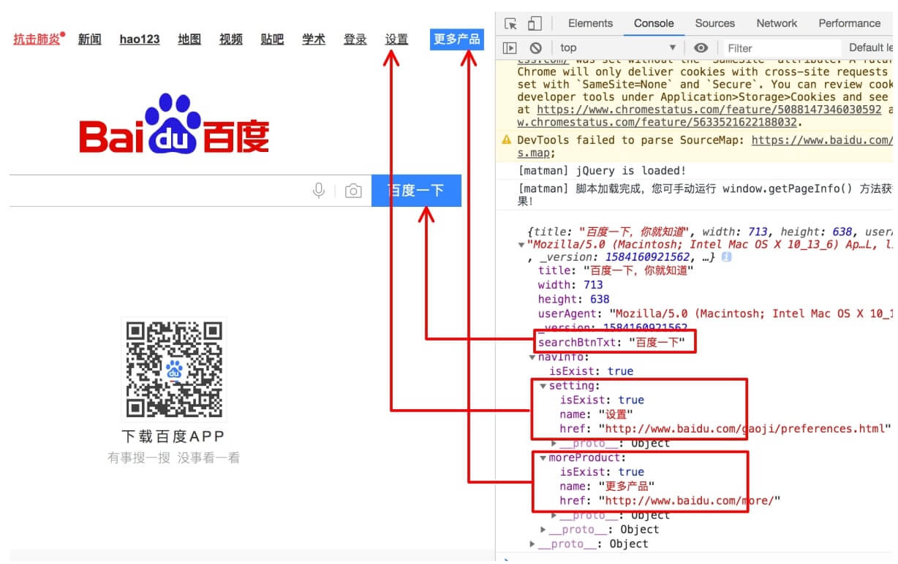

# 01. 第一个端对端测试

本节我们将实现：测试 [https://www.baidu.com](https://www.baidu.com) 首页的UI布局。

## 1. 初始化，安装 matman 依赖

新建一个目录，例如 `baidu_01` ，使用 `npm init` 命令初始化，然后安装 [matman](http://npmjs.com/package/matman):

```
$ npm i matman --save
```

你也可以手动新建一个 `package.json` ，拷贝下面的内容：

```json
{
    "name": "baidu_01",
    "version": "1.0.0",
    "scripts": {
        "build": "matman build",
        "build-dev": "matman build --dev"
    },
    "dependencies": {
        "matman": "^4.0.7"
    }
}
```

## 2. 配置 matman.config.js

在目录下增加一个 `matman.config.js` 文件，与 `package.json` 同级目录，内容如下：

```js
const path = require('path');

module.exports = {
    rootPath: __dirname,
    testerPath: path.join(__dirname, './src')
};
```

其中 `testerPath` 指定了我们的测试用例存放在那个目录下，这里我们指定为 `src` ，因此需要手动增加 `src` 文件夹。

## 3. 编写端对端测试模块

### 3.1 编写爬虫脚本

新增 `src/page_baidu_index/crawlers/get-page-info.js` 文件，内容如下：

```
module.exports = () => {
    return {
        title: document.title,
        width: window.innerWidth,
        height: window.innerHeight,
        userAgent: navigator.userAgent,
        _version: Date.now(),
        searchBtnTxt: document.querySelector('#su').value,
        navInfo: getNavInfo()
    };
};

/**
 * 获取导航模块的信息
 */
function getNavInfo() {
    const jqContainer = $('#u1');
    let result = {
        isExist: !!jqContainer.length
    };

    function getNavData(nameAttr) {
        const jqItem = $(`a[name=${nameAttr}]`, jqContainer);

        const data = {
            isExist: !!jqItem.length
        };

        if (data.isExist) {
            data.name = jqItem.text();
            data.href = jqItem.attr('href');
        }

        return data;
    }

    if (result.isExist) {
        result.setting = getNavData('tj_settingicon');
        result.moreProduct = getNavData('tj_briicon');
    }

    return result;
}
```

编写完成之后，我们可以在浏览器内进行验证，执行爬虫脚本的打包命令：

```
$ npm run build-dev
```

上述命令会生成一个调试脚本 `build/crawler-script_dev/page_baidu_index/crawlers/get-page-info.js` ，拷贝所有的内容在浏览器 `console` 控制台，查看输出：




### 3.2 编写执行脚本

新增 `src/page_baidu_index/cases/basic-check/index.js` 文件，内容如下：

```
const matman = require('matman');

function getResult(opts) {
    // 1. 获取 caseParser 对象
    const caseParser = new matman.CaseParser(__dirname);

    // 2. 获取页面的 url
    const pageUrl = 'https://www.baidu.com';

    // 3. 获取 crawlerScript 爬虫脚本路径
    const crawlerScriptPath = caseParser.getCrawlerScriptPath('../../crawlers/get-page-info');

    // 4. 获得一些配置参数
    const reqOpts = Object.assign({
        device: {
            'UA': 'Mozilla/5.0 (Windows NT 10.0; Win64; x64) AppleWebKit/537.36 (KHTML, like Gecko) Chrome/62.0.3202.75 Safari/537.36',
            'width': 1250,
            'height': 400
        },
        wait: '#su',
        screenshot: true
    }, opts);

    // 5. 执行并返回 Promise 结果
    return caseParser.handleScan(pageUrl, crawlerScriptPath, reqOpts);
}

module.exports = getResult;

// getResult({ show: true, doNotEnd: true, useRecorder: false })
//     .then(function (result) {
//         console.log(JSON.stringify(result));
//     })
//     .catch(function (error) {
//         console.error('failed:', error);
//     });
```

编写之后，如果要自测，则可以将文件最末尾的注释去掉，然后用 node 执行该文件。


### 3.3 编写测试脚本

新增 `src/page_baidu_index/cases/basic-check/index.test.js` 文件，内容如下：

```
const expect = require('chai').expect;

const checkPage = require('.');

describe('百度首页：常规检查', function () {
    this.timeout(30000);

    let resultData;

    before(function () {
        return checkPage({ show: false, doNotEnd: false, useRecorder: true })
            .then(function (result) {
                // console.log(JSON.stringify(result));
                resultData = result;
            });
    });

    describe('检查基本信息', function () {
        let data;

        before(function () {
            data = resultData.data;
        });

        it('网站title应该为：百度一下，你就知道', function () {
            expect(data.title).to.equal('百度一下，你就知道');
        });

        it('搜索按钮的文字应该为：百度一下', function () {
            expect(data.searchBtnTxt).to.equal('百度一下');
        });

        it('顶部导航信息正确', function () {
            expect(data.navInfo).to.eql({
                'isExist': true,
                'moreProduct': { 'href': 'http://www.baidu.com/more/', 'isExist': true, 'name': '更多产品' },
                'setting': { 'href': 'http://www.baidu.com/gaoji/preferences.html', 'isExist': true, 'name': '设置' }
            });
        });
    });
});

```

安装 [mocha](http://npmjs.com/package/mocha) 和 [chai](http://npmjs.com/package/chai) ：

```
$ npm i mocha chai --save-dev
```

配置 npm scripts 命令，最后的 package.json 长这样：

```
{
    "name": "baidu_01",
    "version": "1.0.0",
    "scripts": {
        "build": "matman build",
        "build-dev": "matman build --dev",
        "test": "npm run build && mocha src/**/*.test.js"
    },
    "dependencies": {
        "matman": "^4.0.7"
    },
    "devDependencies": {
        "chai": "^4.2.0",
        "mocha": "^7.1.0"
    }
}
```

### 3.4 执行端对端测试

运行如下命令，执行端对端测试：

```
$ npm test
```

