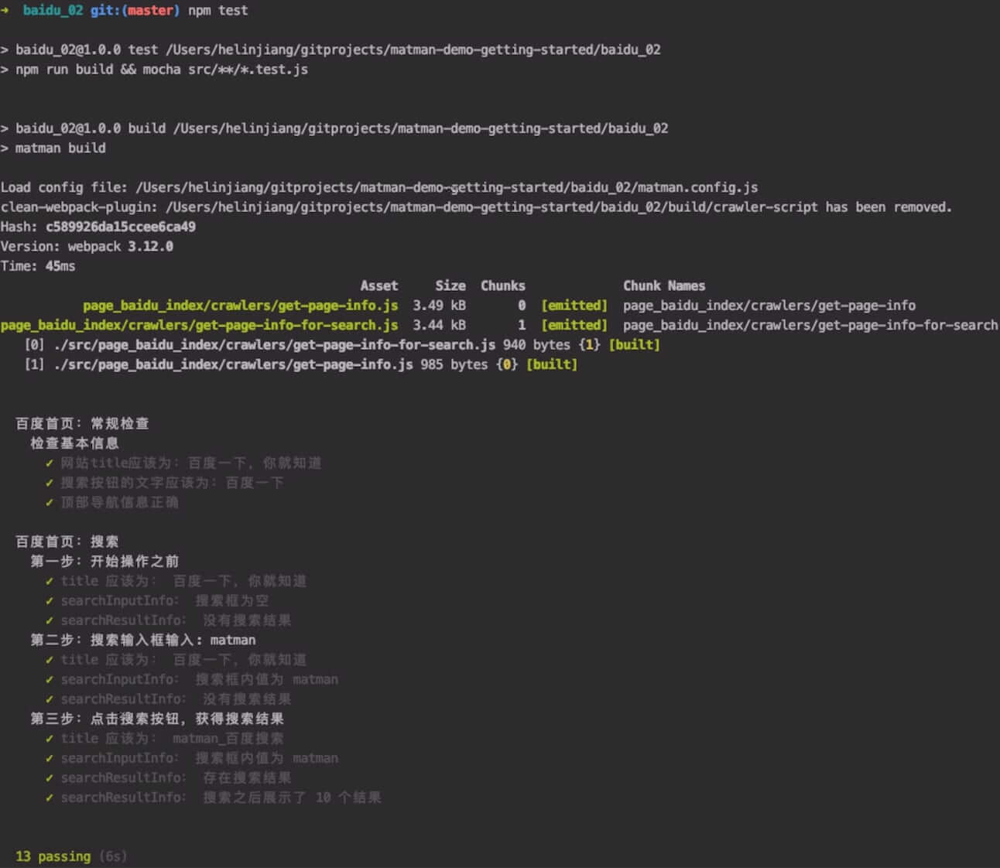

# 02. 测试用户交互

本节我们将实现：在 [https://www.baidu.com](https://www.baidu.com) 中输入 `matman` ，并且验证交互逻辑。

> 最终的代码参考： [https://github.com/matmanjs/matman-demo-getting-started/tree/master/baidu_02](https://github.com/matmanjs/matman-demo-getting-started/tree/master/baidu_02)

## 1. 创建项目 baidu_02

复制 `baidu_01` 目录，命名为 `baidu_02`，并安装依赖。

## 2. 编写端对端测试模块

本次测试中，一共将发生三个动作，依次是：

- 第一步：加载页面
- 第二步：在输入框内输入 `matman`
- 第三步：点击搜索按钮

每一个动作都会带来一定的变化，我们将其称之为一个新的"数据快照"。通过对比动作前后的两个快照变化，如果变化是符合预期的，则说明该次动作的端对端测试通过。为了更好的处理快照，我们为快照命名：

- 第一步：加载页面之后，产生的快照命名为 `init`
- 第二步：在输入框内输入 `matman` 之后，产生的快照命名为 `input_key_word`
- 第三步：点击搜索按钮之后，产生的快照命名为 `click_to_search`


### 2.1 编写爬虫脚本

新增 `src/page_baidu_index/crawlers/get-page-info-for-search.js` 文件。

每一次动作之后产生的信息是非常多的，大部分时候我们不需要全部爬取出来，我们只需要选择我们关注的点即可。例如，本次测试过程，我们选取了三个部分来验证功能，接下来会简单介绍为什么我们这么考虑。

第一部分：页面的 title 。我们发现在搜索之前 title 值为 `百度一下，你就知道`，而搜索之后，title 会变为 `matman_百度搜索` 这种。

```js
const title = document.title;
```

第二部分：搜索框的信息。我们将输入 `matman` 这个关键词，在页面加载完成时，显然输入框内容为空，输入关键词然后点击搜索按钮之后，输入框内都会保留这个 `matman`。

```js
/**
 * 获取搜索框相关的信息
 */
function getSearchInputInfo() {
    return {
        keyWorld: $('#kw').val(),
        searchBtnText: $('#su').val()
    };
}
```

第三部分：搜索结果信息。显然这个不用解释，搜索之前一定没有搜索结果，而点击搜索按钮之后，预期能够获得搜索结果。

```js
/**
 * 获取搜索结果相关的信息
 */
function getSearchResultInfo() {
    const jqContainer = $('#content_left');
    const result = {
        isExist: !!jqContainer.length,
        list: []
    };

    function getItemData(jqItem) {
        return {
            title: $('.t', jqItem).text().trim(),
            describe: $('.c-abstract', jqItem).text().trim(),
            tpl: jqItem.attr('tpl')
        };
    }

    $('.c-container', jqContainer).each(function () {
        result.list.push(getItemData($(this)));
    });

    return result;
}
```

编写完成之后，我们可以在浏览器内进行验证，执行爬虫脚本的打包命令：

```
$ npm run build-dev
```

上述命令会生成一个调试脚本 `build/crawler-script_dev/page_baidu_index/crawlers/get-page-info-for-search.js` ，拷贝所有的内容在浏览器 `console` 控制台，然后查看输出即可。

> 编写爬虫脚本的过程，就是梳理业务的过程。爬取什么样的内容完全依据你的业务逻辑。

### 2.2 编写执行脚本

新增 `src/page_baidu_index/cases/search-check/index.js` 文件。

本次测试过程涉及了三个动作，因此两个 case 中 [search-check](https://github.com/matmanjs/matman-demo-getting-started/blob/master/baidu_02/src/page_baidu_index/cases/search-check/index.js) 与 [basic-check](https://github.com/matmanjs/matman-demo-getting-started/blob/master/baidu_01/src/page_baidu_index/cases/basic-check/index.js) 的执行脚本是有区别的：

```js
    // 5. 执行并返回 Promise 结果
    return caseParser.handleOperate(pageUrl, crawlerScriptPath, reqOpts, (testAction) => {
        // 第一步：开始操作之前
        testAction.addAction('init', function (nightmareRun) {
            return nightmareRun.wait(500);
        });

        // 第二步：搜索输入框输入: matman
        testAction.addAction('input_key_word', function (nightmareRun) {
            return nightmareRun.type('#kw', 'matman').wait(500);
        });

        // 第三步：点击搜索按钮，获得搜索结果
        testAction.addAction('click_to_search', function (nightmareRun) {
            return nightmareRun.click('#su').wait('#content_left');
        });
    });
```

### 2.3 编写测试脚本

新增 `src/page_baidu_index/cases/search-check/index.test.js` 文件。

两个 case 中 [search-check](https://github.com/matmanjs/matman-demo-getting-started/blob/master/baidu_02/src/page_baidu_index/cases/search-check/index.test.js) 与 [basic-check](https://github.com/matmanjs/matman-demo-getting-started/blob/master/baidu_01/src/page_baidu_index/cases/basic-check/index.test.js) 的测试脚本也是有区别的。具体请查看 [源码](https://github.com/matmanjs/matman-demo-getting-started/blob/master/baidu_01/src/page_baidu_index/cases/basic-check/index.test.js) 。

需要补充的是，此步骤是为了对比数据快照之间的区别，因此，每一个步骤执行之后验证的重点是不一样的，依据业务自身特点，至少要涵盖关键变化。例如第二步输入搜索词之后，需要关注输入框内是否真存在搜索词，而第三步点击搜索按钮之后，则重点看搜索结果是否存在，同时页面 title 也发生了变化。

### 2.4 执行端对端测试

运行如下命令，执行端对端测试：

```
$ npm test
```



同时，由于我们配置了测试过程截图，因此可以在 `build/screenshot/page_baidu_index_cases` 目录下看到截图：

- 第一步：加载页面


- 第二步：在输入框内输入 `matman`


- 第三步：点击搜索按钮
