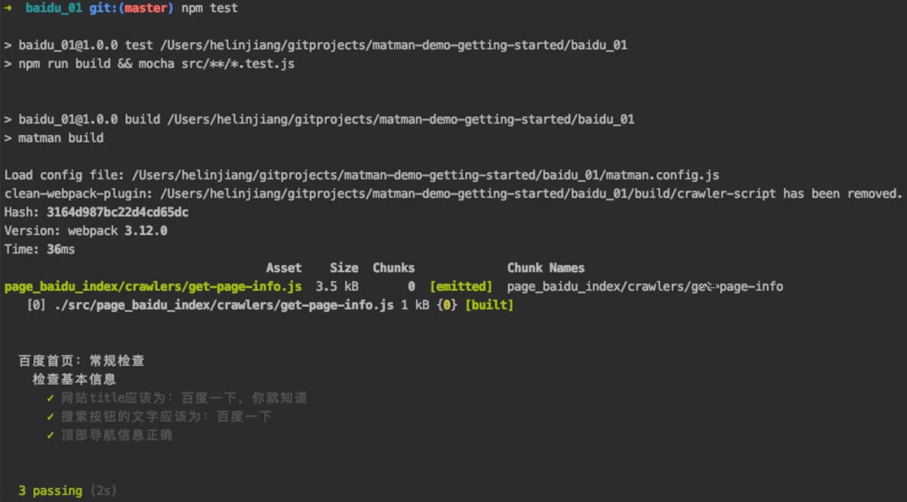

# 02. 测试用户交互

本节我们将实现：在 [https://www.baidu.com](https://www.baidu.com) 中输入 `matman` ，并且验证交互逻辑。

## 1. 创建项目 baidu_02

复制 `baidu_01` 目录，命名为 `baidu_02`，并安装依赖。

## 2. 编写端对端测试模块

本次测试中，一共将发生三个动作，依次是：

- 第一步：加载页面
- 第二步：在输入框内输入 `matman`
- 第三步：点击搜索按钮

每一个动作都会带来一定的变化，我们将其称之为一个新的"数据快照"。通过对比动作前后的两个快照变化，如果变化是符合预期的，则说明该次动作的端对端测试通过。为了更好的处理快照，我们为快照命名：

- 第一步：加载页面之后，产生的快照命名为 `init`
- 第二步：在输入框内输入 `matman` 之后，产生的快照命名为 `input_key_word`
- 第三步：点击搜索按钮之后，产生的快照命名为 `click_to_search`


### 2.1 编写爬虫脚本

新增 `src/page_baidu_index/crawlers/get-page-info-for-search.js` 文件，内容如下：

```
module.exports = () => {
    return {
        title: document.title,
        searchInputInfo: getSearchInputInfo(),
        searchResultInfo: getSearchResultInfo()
    };
};

/**
 * 获取搜索框相关的信息
 */
function getSearchInputInfo() {
    return {
        keyWorld: $('#kw').val(),
        searchBtnText: $('#su').val()
    };
}

/**
 * 获取搜索结果相关的信息
 */
function getSearchResultInfo() {
    const jqContainer = $('#content_left');
    const result = {
        isExist: !!jqContainer.length,
        list: []
    };

    function getItemData(jqItem) {
        return {
            title: $('.t', jqItem).text().trim(),
            describe: $('.c-abstract', jqItem).text().trim(),
            tpl: jqItem.attr('tpl')
        };
    }

    $('.c-container', jqContainer).each(function () {
        result.list.push(getItemData($(this)));
    });

    return result;
}
```

编写完成之后，我们可以在浏览器内进行验证，执行爬虫脚本的打包命令：

```
$ npm run build-dev
```

上述命令会生成一个调试脚本 `build/crawler-script_dev/page_baidu_index/crawlers/get-page-info-for-search.js` ，拷贝所有的内容在浏览器 `console` 控制台，然后查看输出即可。


### 2.2 编写执行脚本

新增 `src/page_baidu_index/cases/search-check/index.js` 文件，内容如下：

```
const matman = require('matman');

function getResult(opts) {
    // 1. 获取 caseParser 对象
    const caseParser = new matman.CaseParser(__dirname);

    // 2. 获取页面的 url
    const pageUrl = 'https://www.baidu.com';

    // 3. 获取 crawlerScript 爬虫脚本路径
    const crawlerScriptPath = caseParser.getCrawlerScriptPath('../../crawlers/get-page-info');

    // 4. 获得一些配置参数
    const reqOpts = Object.assign({
        device: {
            'UA': 'Mozilla/5.0 (Windows NT 10.0; Win64; x64) AppleWebKit/537.36 (KHTML, like Gecko) Chrome/62.0.3202.75 Safari/537.36',
            'width': 1250,
            'height': 400
        },
        wait: '#su',
        screenshot: true
    }, opts);

    // 5. 执行并返回 Promise 结果
    return caseParser.handleScan(pageUrl, crawlerScriptPath, reqOpts);
}

module.exports = getResult;

// getResult({ show: true, doNotEnd: true, useRecorder: false })
//     .then(function (result) {
//         console.log(JSON.stringify(result));
//     })
//     .catch(function (error) {
//         console.error('failed:', error);
//     });
```

编写之后，如果要自测，则可以将文件最末尾的注释去掉，然后用 node 执行该文件。


### 3.3 编写测试脚本

新增 `src/page_baidu_index/cases/basic-check/index.test.js` 文件，内容如下：

```
const expect = require('chai').expect;

const checkPage = require('.');

describe('百度首页：常规检查', function () {
    this.timeout(30000);

    let resultData;

    before(function () {
        return checkPage({ show: false, doNotEnd: false, useRecorder: true })
            .then(function (result) {
                // console.log(JSON.stringify(result));
                resultData = result;
            });
    });

    describe('检查基本信息', function () {
        let data;

        before(function () {
            data = resultData.data;
        });

        it('网站title应该为：百度一下，你就知道', function () {
            expect(data.title).to.equal('百度一下，你就知道');
        });

        it('搜索按钮的文字应该为：百度一下', function () {
            expect(data.searchBtnTxt).to.equal('百度一下');
        });

        it('顶部导航信息正确', function () {
            expect(data.navInfo).to.eql({
                'isExist': true,
                'moreProduct': { 'href': 'http://www.baidu.com/more/', 'isExist': true, 'name': '更多产品' },
                'setting': { 'href': 'http://www.baidu.com/gaoji/preferences.html', 'isExist': true, 'name': '设置' }
            });
        });
    });
});

```

安装 [mocha](http://npmjs.com/package/mocha) 和 [chai](http://npmjs.com/package/chai) ：

```
$ npm i mocha chai --save-dev
```

配置 npm scripts 命令，最后的 package.json 长这样：

```
{
    "name": "baidu_01",
    "version": "1.0.0",
    "scripts": {
        "build": "matman build",
        "build-dev": "matman build --dev",
        "test": "npm run build && mocha src/**/*.test.js"
    },
    "dependencies": {
        "matman": "^4.0.7"
    },
    "devDependencies": {
        "chai": "^4.2.0",
        "mocha": "^7.1.0"
    }
}
```

### 3.4 执行端对端测试

运行如下命令，执行端对端测试：

```
$ npm test
```

